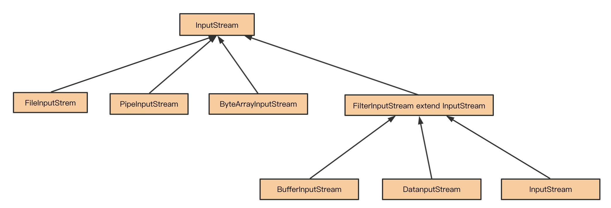

## 装饰者模式

装饰者模式(Decorator)，动态地给一个对象添加一些额外的功能，就增加功能来说，装饰者模式比继承更灵活。

### 装饰者模式解析

老规矩，我们先来看看这样一样例子：咖啡订单程序，咖啡种类有美式咖啡（American coffee）、无因咖啡（Causeless coffee），配料有牛奶（Milk），巧克力（Chocolate）。客户在点咖啡时可以选择配料进行混合。

下面我们使用装饰器模式实现这个例子，具体代码如下：

```java
/**
 * Drink
 */
public abstract class Drink {

    protected String name;

    protected float price;

    public abstract float getCost();

    public abstract String getDescription();

    public String getName() {
        return name;
    }

    public void setName(String name) {
        this.name = name;
    }

    public float getPrice() {
        return price;
    }

    public void setPrice(float price) {
        this.price = price;
    }
}

/**
 * Cafe
 */
public class Cafe extends Drink {

    @Override
    public float getCost() {
        return this.price;
    }

    @Override
    public String getDescription() {
        return "商品：" + this.name + "价格：" + this.price;
    }

}

/**
 * AmericanCafe
 */
public class AmericanCafe extends Cafe {

    public AmericanCafe() {
        this.name = "美式咖啡";
        this.price = 6.0f;
    }

}

/**
 * CauselessCafe
 */
public class CauselessCafe extends Cafe {

    public CauselessCafe() {
        this.name = "无因咖啡";
        this.price = 7.0f;
    }
}

/**
 * AbstractIngredients
 */
public class AbstractIngredients extends Drink {

    private Drink drink;

    public AbstractIngredients(Drink drink) {
        this.drink = drink;
    }

    @Override
    public float getCost() {
        // 添加配料需要加钱
        return super.price + this.drink.getCost();
    }

    @Override
    public String getDescription() {
        return drink.getDescription() + "配料：" + this.name + " 价格：" + this.price ;
    }
}

/**
 * Milk
 */
public class Milk extends AbstractIngredients {

    public Milk(Drink drink) {
        super(drink);
        this.name = "牛奶";
        this.price = 3.0f;
    }
}

/**
 * Chocolate
 */
public class Chocolate extends AbstractIngredients {

    public Chocolate(Drink drink) {
        super(drink);
        this.name = "巧克力";
        this.price = 2.0f;
    }
}

// 使用举例：牛奶巧克力美式咖啡
Drink drink = new Chocolate(new Milk(new AmericanCafe()));
```

看了上面的代码，小伙伴们是不是又看到了“组合原则”的影子。但是装饰器模式相对于简单的组合关系，还有两个比较特殊的地方。

第一个比较特殊的地方是：**装饰器类和原始类继承相同的父类，这样我们可以对原始类“嵌套”多个装饰器类**。就像上面代码中的使用例子一样：`new Chocolate(new Milk(new AmericanCafe()))`。

第二个比较特殊的地方是：**装饰器类是对功能的增强，这也是装饰器模式应用场景的一个重要特点**。实际上，符合“组合原则”这种代码结构的设计模式有很多，比如代理模式、桥接模式，还有现在的装饰器模式。尽管它们的代码结构很相似，但是每种设计模式的意图是不同的。就拿比较相似的代理模式和装饰器模式来说：代理模式中，代理类附加的是跟原始类无关的功能；而在装饰器模式中，装饰器类附加的是跟原始类相关的增强功能。

### Java IO 中的装饰者模式

装饰器模式在 Java IO 类中使用很多，比如FileInputStream、PipedInputStream、ByteArrayInputStream 等。看下图 InputStream 派生出来的部分类。



我们知道 InputStream 代表了输入流，具体的输入来源可以是文件（FileInputStream）、管道（PipedInputStream）、数组（ByteArrayInputStream）等，这些就像前面咖啡例子中的美式咖啡、无因咖啡，属于基础输入流。

FilterInputStream 是一个装饰接口，它的实现类是一系列装饰器，比如 BufferedInputStream 代表用缓冲来装饰，也就使得输入流具有了缓冲的功能，LineNumberInputStream 代表用行号来装饰，在操作的时候就可以取得行号了，DataInputStream 的装饰，使得我们可以从输入流转换为 Java 中的基本类型值。

### 总结

一般情况下，当系统需要新功能的时候，是向旧的类中添加新的代码。这些新加的代码通常装饰了原有类的核心职责或主要行为，但这种做法的问题在于，它们在主类中加入了新的字段，新的方法和新的逻辑，从而增加了主类的复杂度，而这些新加入的东西仅仅是为了满足一些只在某种特定情况下才执行的特殊行为的需要。  

而装饰者模式却提供了一个非常好的解决方案，装饰者模式是为已有功能动态地添加更多功能的一种方式，它把每个要装饰的功能放在单独的类中，并让这个类包装它所要装饰的对象，因此，当需要执行特殊行为时，客户代码就可以在运行时根据需要有选择地、按顺序地使用装饰功能包装对象了。  

装饰者模式的好处就是有效地把**类的核心职责**和**装饰功能**区分开了，而且可以去除相关类中重复的装饰逻辑。

